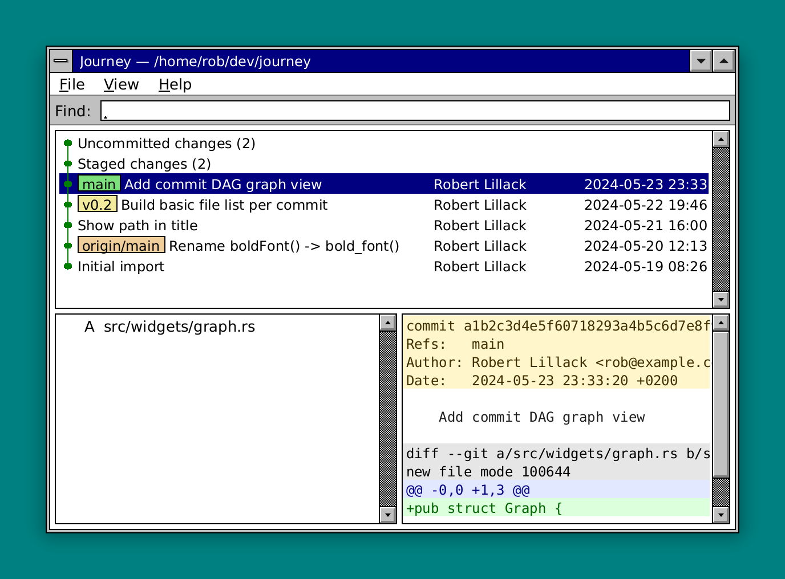
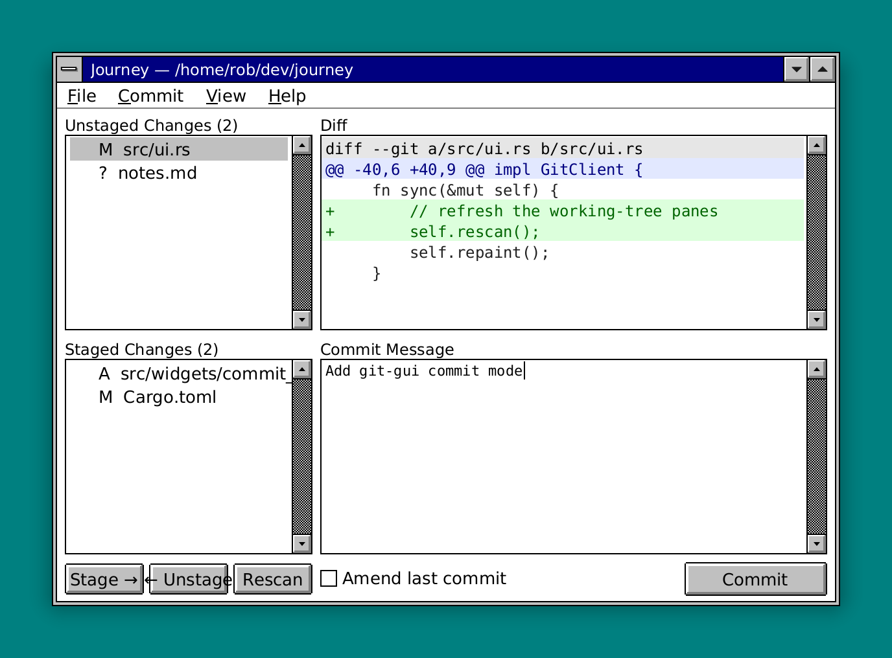

# Git Journey

[](https://github.com/roblillack/gitj/actions/workflows/ci.yml)
[](https://crates.io/crates/gitj)
[](LICENSE)

A gitk-style repository browser and commit helper built on the
[Saudade](https://github.com/roblillack/saudade) toolkit.

```
gitj            # browse the repository containing the current directory
gitj /path/repo # browse the repository at (or above) a given path
```

Git Journey has two screens — the gitk-style **browse** (history) screen and the
`git gui`-style **commit** (staging) screen. Switch between them from the
**View** menu, by double-clicking a working-tree entry in the log, or
automatically: committing drops you back to the log.

## Screenshots

Browse screen — gitk-style history with the DAG graph, ref badges and a
`git show`-style detail/diff pane:



Commit screen — `git gui`-style staging with unstaged/staged lists, a per-file
diff and the message editor:



<!--
These images are rendered by [`examples/screenshots.rs`](examples/screenshots.rs),
which drives the real UI against the in-memory `FixtureBackend` through saudade's
offscreen `MockBackend`, then wraps each window in Canoe-style chrome — title
bar, frame and drop shadow — with `render_framed` and captures it at 2× for
crisp hi-DPI output. Regenerate them with `cargo run --example screenshots`.
-->


### Installation

```sh
cargo install gitj
```

### Browse

* **Commit history** with a colored DAG **graph** column, branch / tag /
  HEAD **ref badges**, and author + date columns.
* **`git show`-style detail**: selecting a commit shows its SHA, refs,
  author, date, message and full diff; selecting a file narrows the diff to
  that file.
* **Diff view** with the usual coloring — green additions, red deletions,
  blue hunk headers, gray file headers.
* **Graphical image diff**: selecting a changed image (PNG, JPEG, GIF, WebP,
  BMP, TIFF, …) shows the two versions visually instead of a "binary files
  differ" line. Compare them side by side (**2-up**), with a **swipe** split, an
  **onion-skin** cross-fade, or a per-pixel **difference** heatmap — switched
  from the button row or the **View** menu (**Switch Mode**, Ctrl+M), with a
  slider driving the swipe / onion position. **Before** / **After Image**
  (Ctrl+Left / Ctrl+Right) show just the old / new side full size, and **Next** /
  **Previous Image** (Ctrl+N / Ctrl+P) step between the image files in the active
  list. Works in both the browse and commit diff panes.
* **Working-tree entries**: when there are local changes, the log leads with
  "Uncommitted changes" / "Staged changes" rows (connected into the graph at
  `HEAD`). Selecting one previews its files and diff; **double-clicking** it
  opens the commit screen.
* **Search / filter** the history live by message, author, ref or SHA.

### Commit

* **Unstaged** and **Staged** file lists (à la `git gui`). Double-click a
  file to stage / unstage it, or use the **Stage** / **Unstage** buttons.
* The **diff pane** shows the selected file's change — working-tree-vs-index
  for unstaged files, index-vs-`HEAD` for staged ones.
* **Revert / discard** an unstaged change (`git gui`'s **Revert Changes**,
  **Ctrl+J**): a tracked file is reset to its index copy, while an *untracked*
  file — having nothing to revert to — is offered up for deletion instead.
  Either way a confirm dialog guards the irreversible discard.
* A multi-line **message editor** and a **Commit** button.
* **Amend last commit**: ticking the box pre-fills the editor with `HEAD`'s
  message *and* re-bases the staging view on `HEAD`'s parent, so the changes
  already in the last commit show up as staged. Unstage any of them to drop
  them from the amended commit; committing then rewrites `HEAD` rather than
  adding a new commit.
* **Rescan** re-reads the working tree. Committing returns to the log view,
  which now shows the new commit.
* **Keyboard shortcuts** mirror `git gui` (and are shown next to each menu
  item): **Ctrl+B** / **Ctrl+C** switch between the **Browse History** and
  **Commit Changes** screens — the active one is checkmarked in the **View**
  menu — **Ctrl+Enter** commits, **Ctrl+T** stages the selected file, **Ctrl+I**
  stages everything, **Ctrl+J** reverts (or deletes) the selected unstaged file,
  **Ctrl+S** appends a `Signed-off-by` trailer, and **Ctrl+R** rescans. The
  message editor takes the usual **Ctrl+C / X / V / A**: Ctrl+C only switches
  screens from the browse view, so it stays available as copy while you edit the
  commit message. **Ctrl+Q** quits from either screen.

### Throughout

* **Menu bar** (File ▸ Reload / Exit, View ▸ switch screen, Help ▸ About) with
  Alt-accelerators and a modal About / error dialog.
* Keyboard navigation: Tab cycles the panes, arrows/PageUp/Down drive the
  focused list or scroll the diff.

## Architecture

The UI never touches `git2` directly — it goes through a small backend
abstraction, which keeps everything testable without a live repository.

| Module | Contents |
|--------|----------|
| `backend` | `RepoBackend` trait + data types (`CommitInfo`, `FileChange`, `Diff`/`DiffLine`, `BlobPair`, `RefLabel`, `WorkingStatus`). Browse reads history/diffs; commit mode adds working-tree status, per-file diffs, `stage`/`unstage`, `revert`/`delete_untracked`, `commit` (with amend); image diffs read the two sides' raw blobs (`commit_file_blobs`/`working_file_blobs`). Implementations: `Git2Backend` (live, libgit2) and `FixtureBackend` (deterministic, in-memory, with a simulated working tree). |
| `imagediff` | Decodes image blobs (via the `image` crate) and composes the two sides into a comparison canvas for the 2-up / swipe / onion-skin / difference modes — the toolkit-independent half of the graphical diff. |
| `widgets` | git-specific widgets — `CommitList` (graph + badges + columns), `DiffView` (colored diff), `ImageDiffView` (graphical image diff) wrapped by `DiffPane` (shows whichever the file calls for), `SearchBar`, `Heading`, `graph` (DAG lane assignment); `Shell`, a generic flat-focus container, plus a `layout` module giving the browse and commit screens their rectangles; generic `Shared<W>` adapter. |
| `ui` | `GitClient`, the top-level widget. It owns both screens (a `Shell` each), switches between them, and — since saudade widgets are callback-free — polls selections and a small command queue after each event to rebuild dependent panes. |

## Testing

* **Pixel snapshots** (`tests/snapshots.rs`) render the real UI through
  saudade's offscreen `MockBackend` at 1.0× against the
  in-memory `FixtureBackend` and bundled DejaVu fonts, comparing PNG bytes
  with `insta`. Regenerate with `INSTA_UPDATE=always cargo test --test
  snapshots`, then review with `cargo insta review`.
* **`tests/git2_backend.rs`** builds a throwaway repository with fixed
  signatures/timestamps and reads it back through `Git2Backend`, so the live
  backend is covered deterministically.
* **`tests/image_blobs.rs`** commits and edits a PNG in a throwaway repository
  and asserts `Git2Backend` returns the exact blob bytes for each side of a
  commit and working-tree image change.
* **`tests/commit_backend.rs`** exercises commit mode end to end: it stages,
  unstages, reverts, commits and amends in a throwaway repository (and against
  the fixture), asserting the working-tree status at each step.
* **`tests/shortcuts.rs`** drives a real `GitClient` through synthetic key
  events (Ctrl+T / I / J / Enter / Q) and asserts the resulting working-tree
  and commit state — the runtime path minus the windowing.
* **Unit tests** cover the graph lane algorithm and date formatting.

```
cargo test          # everything
cargo build         # the binary
```
